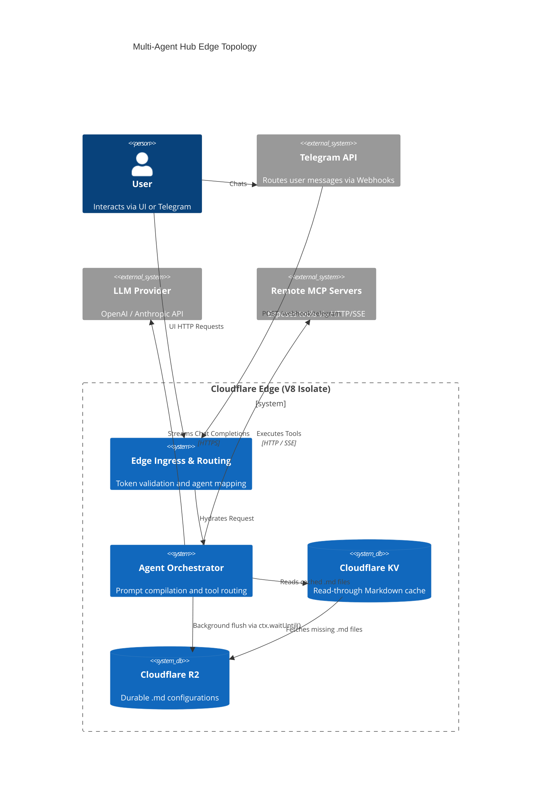
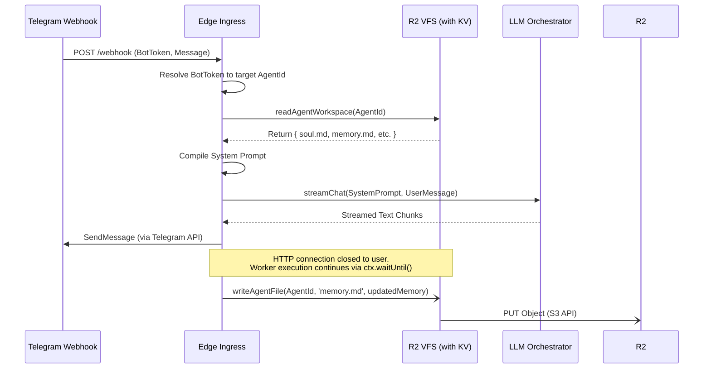
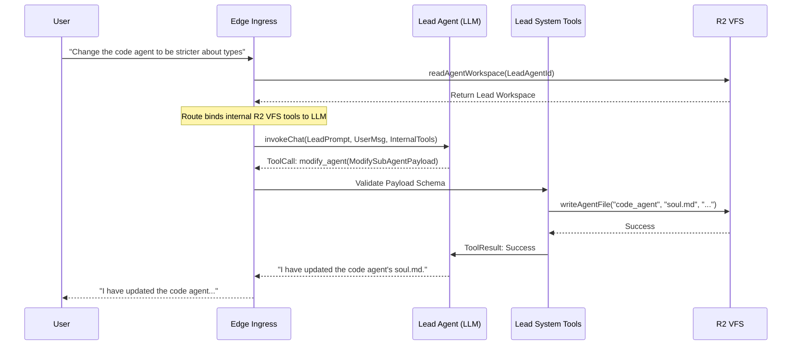

# Project

## Lightweight Multi-Agent Edge Hub PRD

### Product Intent & Context
#### Problem Space & Boundaries
The current ecosystem of multi\-agent AI frameworks relies heavily on opaque, code\-centric orchestration and rigid databases\. This creates severe friction for developers and "vibe coders" who want to iterate on agent behavior rapidly\. Users lack a transparent platform where AI personas and memories can be version\-controlled, easily edited as plain text, and dynamically orchestrated without heavy infrastructure overhead\.

We are building a lightweight, edge\-native all\-in\-one AI agent control center\. The core architecture replaces traditional database\-backed memory with a "Markdown Workspace" paradigm, where simple plain\-text `.md` files define agent identity, rules, and history\. Operating on top of this file system is a hierarchical network consisting of a powerful, autonomous Lead Agent that acts as a router and administrator, and specialized Sub\-agents that handle isolated tasks\.

##### Product Boundaries:
**In\-Scope:** Virtual file system compilation, hierarchical agent routing, Web UI management, Telegram channel bindings, and capability extensions via the Model Context Protocol \(MCP\)\.

**Out\-of\-Scope:** We are not building or hosting foundational LLMs, relational databases, complex vector\-search RAG pipelines, or external MCP servers themselves\. The system relies entirely on standard MCP connections to interact with the outside world\.

#### Actors & Stakeholders
**The Admin / Operator:** The primary user interacting with the Web Control Center\. They write the `.md` workspace files, configure external MCP endpoints, bind Telegram bots, and monitor agent drift\.

**The Telegram End User:** The person chatting with the agents via Telegram bots\. They expect context\-aware responses and, depending on the bot binding, expect either an intelligent global router or a highly specialized, isolated persona\.

**The Lead Agent:** A system\-level orchestrator\. It acts autonomously to read user intent, write new configuration files, spawn Sub\-agents, and synthesize multi\-agent outputs\.

**The Sub\-agents:** System\-level specialized workers\. They operate in strict isolation, executing tasks using only their assigned workspace and capabilities without access to the broader system context\.

**Development Team \(Stakeholder\):** The team delivering the prompt\-compilation engine and edge routing logic\. Because AI behavior is non\-deterministic, they require explicit product\-level observability tools to trace how `.md` files are stitched together and why the Lead Agent made specific routing decisions\.

### Core Capabilities & Requirements
#### The Markdown Workspace \(Identity & Memory\)
The virtual file system serves as the single source of truth for all agent behavior and state\.

The system must support isolated workspace directories for every configured agent \(both Lead and Sub\-agents\)\.

The system must automatically read and compile the core `.md` workspace files \(`soul.md` for values/tone, `identity.md` for role/metadata, `user.md` for human operator context, `memory.md` for episodic logs, and `tools.md` for MCP capabilities\) into a structured LLM system prompt upon agent invocation\.

The Web Control Center must provide a visual file editor to allow the Admin to manually create, read, update, and delete workspace files\.

The system must grant agents the capability to persistently append new factual observations and episodic logs back to their own `memory.md` file to maintain continuity across chat sessions\.

#### Hierarchical Orchestration \(Lead vs\. Sub\-Agents\)
The system enforces strict power dynamics between the orchestration layer and execution layer\.

The Lead Agent must possess global read and write privileges across the entire virtual workspace\.

The Lead Agent must be capable of autonomously creating a new workspace directory and generating baseline `.md` files to spawn a new Sub\-agent when confronted with a novel user request\.

Sub\-agents must operate in strict sandboxed isolation; they are restricted to reading and writing within their assigned workspace directory\.

Sub\-agents must be entirely unaware of the Lead Agent’s configuration, memory, or the existence of sibling Sub\-agents\.

The Lead Agent must be able to interpret a user request, delegate portions of the task to appropriate Sub\-agents, and synthesize the returned data into a cohesive final response\.

#### MCP Extensibility \(Capabilities\)
The system strictly relies on the Model Context Protocol \(MCP\) to attach external skills and data sources to agents\.

All external API, database, and tool connections must be integrated exclusively via MCP\.

The system must support scoping MCP tools globally \(available to the Lead Agent\) or locally \(restricted to a specific Sub\-agent via its `tools.md` file\)\.

The system must automatically fetch, parse, and translate the JSON\-RPC schemas provided by connected external MCP servers into valid tool\-call formats for the underlying LLM\.

The Web Control Center must allow the Admin to configure MCP server endpoints \(e\.g\., URLs, authentication headers\) and assign those endpoints to specific agent workspaces\.

#### Multi\-Channel Delivery \(Web UI & Telegram\)
The platform exposes different interface rules depending on the delivery channel and the binding configuration\.

The Web Control Center must serve as the primary administrative dashboard for workspace management, MCP configuration, and direct agent testing\.

When a Telegram bot is bound directly to the Lead Agent, the chat channel must support full multi\-agent routing, with the Lead Agent acting as the invisible dispatcher for the Telegram End User\.

When a Telegram bot is bound to a specific Sub\-agent, the bot must operate as a strictly isolated entity, explicitly rejecting requests outside its `.md` defined scope and exhibiting zero awareness of the broader system\.

### Implementation Readiness & Reviewability
Because the platform relies on dynamic prompt compilation and autonomous file mutation, ensuring rapid iteration and deterministic debugging is a core product requirement\. The following loops must be built natively into the Web Control Center\.

#### Trialability \(Prompt Sandbox, Mocks, & Resets\)
**Active Prompt Sandbox:** The Web Control Center must include an interactive chat playground that provides a toggleable "Prompt Payload Viewer," displaying the exact, final string compiled from the `.md` files and sent to the LLM API\.

**Mock Tool Responses:** The Web Control Center chat playground must allow the Admin to manually type out simulated responses from MCP tools, allowing developers to test how the Lead Agent interprets tool data without hitting live, potentially destructive external APIs\.

**Safe State Resets:** The Web Control Center must provide a one\-click "Reset to Baseline" button for any agent workspace, which clears active episodic memory from `memory.md` while preserving core persona traits in `soul.md` and `identity.md`\.

#### Inspectability & Review \(Diff Logs & Tracing\)
**Autonomous Diff Logs:** Whenever the Lead Agent autonomously alters a Sub\-agent's workspace files, the Web UI must generate a Git\-style line diff showing additions and deletions\.

**Agent Reasoning Strings:** Every entry in the Autonomous Diff Log must be paired with a brief textual explanation generated by the Lead Agent detailing why the state mutation occurred\.

**Execution Tracing:** The Web UI execution logs must generate a visual, sequential chain\-of\-custody diagram for delegated tasks \(e\.g\., `User Request -> Lead Analysis -> Sub-agent Assignment -> MCP Tool Execution -> Lead Synthesis`\)\.

**Error Recovery Visibility:** The Execution Trace must explicitly highlight sub\-agent timeouts or external MCP tool failures, indicating whether the Lead Agent successfully caught and recovered from the error or crashed\.

#### Validation \(Linting & MCP Diagnostics\)
**Auto\-Linting:** The Web Control Center file editor must immediately flag Markdown/JSON formatting errors or invalid MCP tool references upon save, preventing a broken workspace state from reaching the runtime\.

**MCP Ping & Discover:** The Web Control Center MCP configuration panel must include a "Ping & Discover" diagnostic button that executes a standard MCP connection handshake and renders the returned raw JSON payload of available tools and schemas prior to agent execution\.

#### Production Gating & Exposure Rules
The Web Control Center serves as the production environment for the Admin\. All Trialability, Inspectability, and Validation features listed above must remain permanently active and available within this interface\.

Under no circumstances should prompt payloads, execution traces, diff logs, or raw JSON schemas be exposed to the Telegram End User\.

`TODO: Determine if Admins require a Telegram slash command (e.g., /debug) to temporarily view execution traces inline when chatting with a bot they own.`

### Scope, Assumptions & Success
#### Assumptions & Out of Scope
**Consolidated Persona:** We assume the Admin, System Operator, and Developer are the same user persona for this release\. Complex internal Role\-Based Access Control \(RBAC\) within the Web UI is not required\.

**Single External Channel:** We assume Telegram is the only external messaging channel required for the V1 release\. Integrations with Slack, Discord, or generic webhooks are deferred\.

**Storage Latency:** We assume the underlying edge storage mechanism \(e\.g\., Cloudflare R2\) provides acceptable read/write latency for real\-time chat and autonomous file generation without requiring complex client\-side caching\.

**TRD Deferrals:** Specific edge runtime constraints, chunking algorithms for large MCP payloads, and precise V8 isolate logic are out of scope for this document and belong in the Technical Requirements Document\.

#### Success Criteria
The Admin can successfully write a `soul.md` file in the Web UI and verify via the Prompt Sandbox that the compiled payload reflects those exact constraints\.

The Lead Agent successfully provisions a new Sub\-agent autonomously by creating a new workspace directory and baseline `.md` files without human intervention\.

A Telegram End User interacting with a Sub\-agent\-bound bot receives responses strictly limited to that Sub\-agent's assigned tools, proving isolation\.

An Admin can successfully connect a new external MCP server and view its schema using the "Ping & Discover" tool without requiring a system restart or codebase deployment\.

## Edge Multi-Agent Architecture TRD

### Architecture Strategy & Edge Constraints
The system is a stateless orchestration layer deployed as a Cloudflare Worker, acting as a lightweight hub for multi\-agent execution\. Because it must run globally at the edge without a traditional server backbone, the architecture embraces V8 isolate constraints, pushing durable state to object storage and externalizing tool execution via remote protocols\.

**V8 Isolate Lifecycles:** The framework must execute entirely within a Cloudflare Worker environment\. Standard Node\.js modules like `fs`, `net`, `child_process`, and `crypto` \(outside `crypto.subtle`\) are strictly prohibited\.

**Execution Timeout Limits:** All synchronous HTTP responses to user clients \(UI or Telegram\) must conclude within the Cloudflare Worker execution limit \(typically 30 seconds\)\. Deep, multi\-turn tool loops over SSE must be tightly bounded or deferred\.

**R2 Latency and State Hydration:** Agent contexts \(personas, memories, and tools\) are stored as Markdown files in Cloudflare R2\. To prevent severe N\+1 network latency during agent initialization, the virtual file system must rely on concurrent S3 API fetching and Cloudflare KV read\-through caching\.

**Stateless Background Mutations:** The orchestration layer cannot maintain in\-memory state across user sessions\. All conversation history and long\-term memory updates must be explicitly flushed to R2\. To prevent request blocking, these writes must utilize Cloudflare's `ctx.waitUntil()` to execute asynchronously after the HTTP response closes\.

**Optimistic Concurrency:** Initial memory updates to R2 will rely on Last\-Write\-Wins behavior\. TODO: Determine if a more robust locking mechanism \(e\.g\., Cloudflare Durable Objects\) is required for concurrent Telegram message handling in v2\.

### System Boundaries & Topology
The architecture separates network ingress, file hydration, LLM orchestration, and external tooling into isolated domains to minimize blast radius and ensure independent verifiability\.



**Edge Ingress & Routing:** Acts as the stateless entry point for HTTP requests\. Owns authentication, request normalization, and strictly isolates tenant contexts by mapping incoming tokens \(Telegram Bot Tokens or Web UI session tokens\) to a specific target agent identifier\.

**R2 Virtual File System \(VFS\):** Abstracts Cloudflare R2 and KV into a structured file interface\. Owns the latency\-optimized retrieval of Markdown configurations and the asynchronous background flushing of state updates\.

**Agent Context & Orchestrator:** The central command loop\. Owns the compilation of fetched Markdown files into a token\-optimized system prompt, manages the LLM chat lifecycle, and routes tool\-call requests to internal or external handlers\.

**Edge MCP Transport:** Bridges the stateless isolate to stateful Model Context Protocol servers\. Owns the establishment of outbound Server\-Sent Events \(SSE\) connections, tool discovery, and tool execution over network protocols\.

**Lead System Tools:** A suite of privileged, internal tools injected exclusively into the Lead Agent's context\. Owns the secure transformation of the Lead Agent's intent into safe, validated VFS write operations against sub\-agent files\.

### Cross\-Boundary Data Contracts
The following TypeScript definitions dictate the data shapes passed between the Ingress, VFS, and Orchestrator boundaries\. Invalid states are prevented via strict literal types and branded strings\.

#### Identifiers
```typescript
export type AgentId = string & { readonly __brand: unique symbol };
export type SessionId = string & { readonly __brand: unique symbol };
export type AuthToken = string & { readonly __brand: unique symbol };

```

#### MarkdownFileName
```typescript
export type MarkdownFileName = 
  | 'soul.md' 
  | 'identity.md' 
  | 'user.md' 
  | 'memory.md' 
  | 'tools.md';

```

#### AgentRole
```typescript
export type AgentRole = 'LEAD' | 'SUB_AGENT';

```

#### IngressSource
```typescript
export type IngressSource = 'TELEGRAM' | 'WEB_UI';

```

#### AgentWorkspace
```typescript
export interface AgentWorkspace {
  agentId: AgentId;
  files: Record<MarkdownFileName, string | null>;
  lastModifiedEpochMs: number;
}

```

#### IngressPayload
```typescript
export interface IngressPayload {
  sessionId: SessionId;
  source: IngressSource;
  targetAgentId: AgentId;
  content: string;
}

```

#### ModifySubAgentPayload
```typescript
export interface ModifySubAgentPayload {
  targetAgentId: AgentId;
  fileToModify: MarkdownFileName;
  newContent: string;
  reasoning: string;
}

```

### Major Protocol Flows
#### Synchronous Webhook to Asynchronous Flush
This flow illustrates a user interacting with an isolated sub\-agent via Telegram, highlighting how the Worker must hydrate state from R2 before calling the LLM, and how it defers the memory update to a background task\.



#### Lead Agent Sub\-Agent Modification
When a user instructs the Lead Agent to create or adjust a sub\-agent, the Lead Agent utilizes specialized internal system tools\. These tools are strictly validated to prevent unauthorized file access\.



### System\-Level Verification & Deployment Readiness
Because this framework runs entirely on the edge, the architecture must support isolated verification without deploying to Cloudflare or incurring LLM API costs for basic testing\.

**R2 VFS Latency & Concurrency Probe:** Deploy a headless Cloudflare Worker endpoint that concurrently fetches five mock Markdown files \(`soul.md`, `memory.md`, etc\.\) from a live R2 bucket using S3 APIs\. This probe validates whether parallel fetching is sufficient to meet latency goals, or if a Cloudflare KV read\-through cache is mandatory for initial deployment\.

**Worker\-to\-MCP SSE Transport Sandbox:** Deploy a Worker script that establishes an outbound HTTP/SSE connection to a local mock MCP server \(e\.g\., an Express server emitting JSON\-RPC over SSE\)\. This isolates and proves that the V8 isolate can correctly consume, parse, and terminate long\-running SSE streams without native Node\.js `stream` or `net` modules\.

**Lead Agent Schema Enforcement Check:** Execute offline unit tests that feed malicious or hallucinated JSON payloads \(e\.g\., path traversal attempts like `../LeadAgent/soul.md`, or invalid file names\) into the `ModifySubAgentPayload` validation boundary\. This guarantees the system fails securely before executing destructive VFS operations\.

**Ingress Token Routing Isolation:** Run local contract tests that simulate Telegram API payloads containing differing `BotToken` values\. This asserts that the Ingress router strictly isolates `AgentId` assignments and rejects unauthorized tokens before VFS hydration begins\.

**Production Telemetry \(First\-Deploy\):** For the initial production release, monitor `wrangler tail` during a single "Hello" message to a provisioned Sub\-Agent\. This explicitly validates that the background `ctx.waitUntil()` memory update to R2 logs successfully after the HTTP response has been sent to the Telegram API\.

**MCP Secret Provisioning:** TODO: Define where external MCP API keys are stored \(e\.g\., Cloudflare Secrets vs\. KV\) and how they are bound to specific `tools.md` definitions at runtime\.

**Web UI Authorization:** TODO: Define the exact mechanism for Web UI users to authenticate and authorize actions, specifically targeting the Lead Agent, to prevent unauthorized users from executing Lead Agent VFS modifications\.

### Additional Documents
TODO: Child MDS for Markdown OS Engine \- Token truncation algorithms for large memory\.md files, exact prompt assembly concatenation rules \(`soul` > `identity` > `memory`\), and Cloudflare KV cache\-invalidation logic\.
TODO: Child MDS for Edge\-Native MCP Transport \- Internal JSON\-RPC serialization, authentication header injection, timeout fallback logic, and ping/pong keep\-alive handling for SSE streams over HTTP\.
TODO: Child MDS for Ingress Routing and Session Management \- Telegram API payload extraction, webhook signature validation, Web UI JWT/session handling, and short\-term chat history tracking mechanisms\.

## Files Plan

### package\.json
### turbo\.json
### tsconfig\.base\.json
### apps
#### edge\-hub
##### package\.json
##### wrangler\.toml
##### src
###### index\.ts
###### ingress\-router\.ts
###### lead\-workflow\.ts
###### sub\-agent\-workflow\.ts
###### system\-tools\-controller\.ts
###### execution\-tracer\.ts
###### telegram
####### webhook\-handler\.ts
####### api\-client\.ts
####### message\-parser\.ts
##### tests
###### ingress\-router\.test\.ts
###### system\-tools\.test\.ts
###### workflow\.test\.ts
##### worker\-configuration\.d\.ts
#### web\-ui
##### package\.json
##### src
###### components
####### editor
######## MarkdownEditor\.tsx
######## EditorToolbar\.tsx
######## ValidationOverlay\.tsx
####### diff
######## DiffViewer\.tsx
######## LineDiff\.tsx
######## ReasoningTooltip\.tsx
####### trace
######## TraceDiagram\.tsx
######## TraceNode\.tsx
######## ErrorHighlight\.tsx
####### chat
######## ChatPlayground\.tsx
######## MessageList\.tsx
######## MessageBubble\.tsx
######## ChatInput\.tsx
####### sandbox
######## PromptInspector\.tsx
######## MockToolInjector\.tsx
######## StateResetButton\.tsx
####### mcp
######## DiagnosticPing\.tsx
######## EndpointForm\.tsx
######## ToolDiscoverySchema\.tsx
####### layout
######## Sidebar\.tsx
######## WorkspaceHeader\.tsx
######## ErrorBoundary\.tsx
###### hooks
####### useAutoLinting\.ts
####### useVFSClient\.ts
###### store
####### workspaceStore\.ts
###### api
####### mcpClient\.ts
####### vfsClient\.ts
###### main\.tsx
###### App\.tsx
##### vite\.config\.ts
##### tailwind\.config\.js
##### index\.html
### packages
#### contracts
##### package\.json
##### src
###### identifiers\.ts
###### payloads\.ts
###### vfs\-schemas\.ts
###### errors\.ts
###### mcp\-schemas\.ts
###### llm\-schemas\.ts
##### tsconfig\.json
#### vfs
##### package\.json
##### src
###### s3\-fetch\-client\.ts
###### kv\-cache\-manager\.ts
###### workspace\-hydrator\.ts
###### deferred\-flusher\.ts
##### tests
###### deferred\-flusher\.test\.ts
###### workspace\-hydrator\.test\.ts
##### tsconfig\.json
#### compiler
##### package\.json
##### src
###### file\-concatenator\.ts
###### token\-estimator\.ts
###### diff\-generator\.ts
###### prompt\-builder\.ts
##### tests
###### file\-concatenator\.test\.ts
###### diff\-generator\.test\.ts
###### prompt\-builder\.test\.ts
##### tsconfig\.json
#### mcp\-edge
##### package\.json
##### src
###### sse\-consumer\.ts
###### schema\-translator\.ts
###### timeout\-controller\.ts
###### json\-rpc\-parser\.ts
###### sse\-keep\-alive\.ts
##### tests
###### schema\-translator\.test\.ts
###### timeout\-controller\.test\.ts
###### json\-rpc\-parser\.test\.ts
##### tsconfig\.json
### tooling
#### mock\-mcp\-server
##### package\.json
##### src
###### server\.js
###### mock\-tools\.json
#### r2\-concurrency\-probe
##### package\.json
##### src
###### probe\.ts
#### scripts
##### simulators
###### telegram\-cli\.js
###### security\-fuzzer\.js
##### telemetry
###### verify\-flush\.sh
### pnpm\-workspace\.yaml
### eslint\.config\.mjs
### prettier\.config\.js
### vitest\.workspace\.ts
### README\.md

## Implementation Plan

### Milestone 1: Architectural Foundation & Domain Contracts
Establish the monorepo, strict typescript contracts, and pure V8\-safe logic abstractions for compilers and virtual file systems\.

#### Phase 1\.1: Scaffolding & Shared Data Contracts
Initialize pnpm monorepo, configuration pipelines, and centralized branded\-type contracts to strictly enforce data boundaries across isolates\.

##### Init Package Managers & Monorepo Workspaces
Initialize the root \`package\.json\`, \`pnpm\-workspace\.yaml\`, and \`turbo\.json\`\. Define the core workspaces for \`apps/\*\` and \`packages/\*\`\. Set up Turborepo pipeline caching rules for lint, typecheck, test, and build tasks\.

##### Init Base Typescript & Linting Configs
Implement strict base configurations ensuring no implicit any and correct edge target module resolution\. Create \`tsconfig\.base\.json\`, \`eslint\.config\.mjs\`, \`prettier\.config\.js\`, and \`vitest\.workspace\.ts\` to govern monorepo rules\.

##### Implement Branded Identifiers
Create \`identifiers\.ts\` in \`packages/contracts\`\. Define Typescript Branded Types for \`AgentId\`, \`SessionId\`, \`AuthToken\`, and \`MarkdownFileName\` using unique symbols to strictly prevent raw string assignments across functional domains\.

##### Implement LLM & Role Schemas
Implement \`llm\-schemas\.ts\` in \`packages/contracts\`\. Map the standard OpenAI/Anthropic role models \(system, user, assistant\) into exported type definitions and define the strict \`AgentRole\` enum boundary \(\`LEAD\` vs \`SUB\_AGENT\`\)\.

##### Implement VFS & Workspace Schemas
Implement Zod schemas in \`vfs\-schemas\.ts\` for validating the \`AgentWorkspace\` shape\. Ensure \`soul\.md\`, \`identity\.md\`, \`user\.md\`, \`memory\.md\`, and \`tools\.md\` fields are strictly defined as nullable strings or strictly parsed objects\.

##### Implement Ingress & MCP Schemas
Implement Zod schemas in \`mcp\-schemas\.ts\` and define structural types in \`payloads\.ts\` for \`IngressPayload\` and \`ModifySubAgentPayload\`\. Include \`errors\.ts\` mapping standard infrastructure faults throughout the distributed architecture\.

##### Test Domain Contracts & Validators
Write explicit unit tests validating the Zod schemas in \`packages/contracts/tests\`\. Intentionally supply malformed configurations \(e\.g\. invalid markdown file names, omitted required fields\) to ensure \`\.parse\(\)\` and \`\.safeParse\(\)\` reliably fail closed\.

##### Review Phase 1\.1 Scaffolding & Contracts
Present the completed \`packages/contracts\` library to the user\. Ask the user: 1\) Are the Zod schemas correctly mapping the expected system payload constraints without resorting to implicit 'any' types? 2\) Are the branded string identifiers sufficiently rigid for your domain boundaries?

#### Phase 1\.2: V8\-Safe Pure Logic \(Compiler & VFS Interfaces\)
Implement the core formatting, synthesis, and virtual file system abstractions completely isolated from Node\.js standard libraries\.

##### Implement Compiler: File Concatenator
Create \`packages/compiler\`\. Implement \`file\-concatenator\.ts\` providing pure functional logic to sequentially stitch \`soul\`, \`identity\`, \`user\`, \`memory\`, and \`tools\` text contents into a master system prompt string buffer securely\.

##### Test Compiler: File Concatenator
Write unit tests in \`file\-concatenator\.test\.ts\`\. Assert exact concatenation ordering\. Mock scenarios where specific workspace files are null or empty strings, ensuring graceful fallback behavior without injecting undefined formatting\.

##### Implement Compiler: Token Estimator
Implement \`token\-estimator\.ts\`\. Develop heuristic algorithmic chunking logic approximating token counts from character lengths to defensively detect memory accumulation limit overruns\.

##### Test Compiler: Token Estimator
Write unit tests for \`token\-estimator\.ts\`\. Pass large mock memory strings and verify the heuristic threshold correctly triggers a boolean overflow warning for the orchestrator to intercept\.

##### Implement Compiler: Prompt Builder
Implement \`prompt\-builder\.ts\`\. Build logic combining concatenator string outputs, mapping them correctly into OpenAI and Anthropic compatible structured chat input arrays \(e\.g\., mapping \`tools\.md\` into function arrays dynamically\)\.

##### Test Compiler: Prompt Builder
Write \`prompt\-builder\.test\.ts\`\. Assert that final output arrays conform perfectly to required API structures, handling arrays of external capability parameters securely\.

##### Implement Compiler: Diff Generator
Implement \`diff\-generator\.ts\`\. Write a pure function that compares old state strings vs new state strings, outputting an array representing a git\-style line\-by\-line diff \(\`\+\`, \`\-\`, unchanged\) natively without dependencies\.

##### Test Compiler: Diff Generator
Write \`diff\-generator\.test\.ts\`\. Supply strings with modified lines, additions, and deletions, and assert the output strictly matches expected visual Git formatting requirements for the Web UI\.

##### Implement VFS: Workspace Hydrator
Create \`packages/vfs\`\. Implement \`workspace\-hydrator\.ts\` utilizing \`Promise\.all\` wrappers to orchestrate concurrent retrieval of the multiple core \`\.md\` files comprising an agent context\.

##### Test VFS: Workspace Hydrator
Write \`workspace\-hydrator\.test\.ts\`\. Use dependency injection or mocking on the fetch bindings to validate it gracefully recovers via defaults if a requested file returns 404\.

##### Implement VFS: Deferred Flusher
Implement \`deferred\-flusher\.ts\`\. Create an execution wrapper accepting \`ctx\.waitUntil\(\)\` bindings natively, decoupling the write\-back of memory files from the blocking HTTP response loop\.

##### Test VFS: Deferred Flusher
Write \`deferred\-flusher\.test\.ts\`\. Assert that asynchronous promise queues correctly execute resolving logic blocks independently of the synchronous calling function context\.

##### Review Phase 1\.2 V8 Logic
Ask the user to review the entire compiler and VFS structure\. Specifically ask: 1\) Have we definitively avoided all Node\.js built\-ins \(\`fs\`, \`path\`, \`stream\`\) to guarantee isolate compatibility? 2\) Are the Diff Generator mappings ready for Web UI consumption?

### Milestone 2: Edge Orchestration & Transport
Establish real network transports for S3/MCP and build the central Cloudflare Worker hub routing the multi\-agent hierarchy\.

#### Phase 2\.1: Edge Transports & Probes \(R2, KV, & MCP\)
Probe assumption bounds for Cloudflare fetch capabilities and implement pure HTTP transport layers for R2 state and MCP execution\.

##### Explore R2/S3 Fetch Bounds
Create \`tooling/r2\-concurrency\-probe/probe\.ts\`\. Use standard Web Fetch and \`crypto\.subtle\` to construct an AWS SigV4 request\. Concurrently fetch 5 mock S3 objects and document the millisecond latency to confirm it fits within chat response budgets\.

##### Explore LLM Streaming & Parsing Constraints
Write an isolated script using pure Web \`fetch\(\)\`\. Call the OpenAI completions endpoint with \`stream: true\` and a mock tool\. Verify that partial JSON tool\-call fragments can be intercepted and parsed mid\-stream using Web APIs\.

##### Code Mock MCP Server
Create \`tooling/mock\-mcp\-server/server\.js\`\. Build a local Express application configured explicitly to emit fragmented, highly\-delayed JSON\-RPC Server Sent Events over HTTP to act as a harsh network test target for the Edge isolate\.

##### Explore Edge\-Native MCP SSE Parse Strategy
Write a standalone script simulating the Worker runtime connecting to the mock MCP server using ONLY \`fetch\(\)\` and the Web \`ReadableStream\` API\. Prove successful aggregation of multi\-byte UTF\-8 string chunks without Node\.js \`stream\` imports\.

##### Implement VFS: S3 Fetch Client
Implement \`s3\-fetch\-client\.ts\` in \`packages/vfs\`\. Encapsulate the AWS SigV4 request signing logic discovered in the Explore probe, creating an R2 interaction class entirely reliant on standard fetch logic\.

##### Implement VFS: KV Cache Manager
Implement \`kv\-cache\-manager\.ts\`\. Provide read\-through invalidation logic balancing Cloudflare KV bindings with the S3 fallback client to combat initial fetch latency limits\.

##### Test VFS: Data Clients
Write tests for \`s3\-fetch\-client\.ts\` and \`kv\-cache\-manager\.ts\`\. Mock global \`fetch\` to simulate R2 bucket responses and verify the cache read\-through priority perfectly balances hydration speeds\.

##### Implement MCP: SSE Consumer
Create \`packages/mcp\-edge\`\. Operationalize the SSE parse strategy into \`sse\-consumer\.ts\`, abstracting the \`ReadableStream\` reader loop into safe async iterable interfaces\.

##### Implement MCP: JSON RPC Parser
Implement \`json\-rpc\-parser\.ts\`\. Parse the aggregated UTF\-8 string streams coming from the consumer, safely invoking \`JSON\.parse\` only when packet fragmentation boundaries are fully sealed\.

##### Test MCP: JSON RPC Parser
Write \`json\-rpc\-parser\.test\.ts\`\. Inject malformed, deeply fragmented mock strings into the parser engine\. Verify it drops bad packets or catches parse errors safely without cascading failure states\.

##### Implement MCP: Schema Translator
Implement \`schema\-translator\.ts\`\. Write transformation routines bridging standard JSON\-RPC capability definitions into strictly enforced OpenAI function\-calling parameters\.

##### Test MCP: Schema Translator
Write \`schema\-translator\.test\.ts\`\. Feed extensive mocked third\-party MCP schemas through the translator and strictly validate output formatting against rigid LLM validation schemas\.

##### Implement MCP: Timeout & Keep Alive
Implement \`timeout\-controller\.ts\` utilizing \`AbortSignal\` controls to aggressively sever hanging endpoints, and \`sse\-keep\-alive\.ts\` to manage heartbeat pings preventing premature disconnects\.

##### Test MCP: Timeout Controller
Write \`timeout\-controller\.test\.ts\`\. Mock a blocked promise intentionally exceeding timebounds and verify the custom controller strictly aborts execution, safeguarding isolate resource usage\.

##### Review Phase 2\.1 Edge Transports
Request user review of the completed Edge Transports phase\. Verify: 1\) Are the S3 Signature generators functioning? 2\) Is the Edge\-native SSE parser adequately handling mocked network lag without crashing?

#### Phase 2\.2: The Edge Hub Orchestration Engine
Implement the Cloudflare Worker application encapsulating ingress, Lead Agent administration bounds, and isolated Sub\-agent workflows\.

##### Input Runtime Secrets
Prompt the user to create a local \`\.dev\.vars\` file for the \`edge\-hub\` package\. Instruct them to inject \`OPENAI\_API\_KEY\` or \`ANTHROPIC\_API\_KEY\` values to facilitate downstream local Wrangler orchestration testing\.

##### Code Edge Hub Wrangler Scaffold & Index
Create \`apps/edge\-hub/\`\. Construct \`wrangler\.toml\` securely defining KV Namespaces, R2 bucket maps, and global isolate parameter scopes\. Implement \`index\.ts\` binding the raw Cloudflare HTTP \`fetch\` event listener\.

##### Code Ingress Router
Implement \`ingress\-router\.ts\`\. Resolve authentication headers \(Web UI\) or Webhook tokens \(Telegram\) securely\. Establish strict tenant\-isolation mappings enforcing 1\-to\-1 bounds routing external input to the proper logical AgentId context\.

##### Test Ingress Router
Write \`ingress\-router\.test\.ts\`\. Construct simulated conflicting token requests simulating adjacent tenant actions\. Explicitly verify the router throws authorization blocks rather than allowing context bleed\.

##### Code System Tools Controller
Implement \`system\-tools\-controller\.ts\`\. Define the internal execution functions mapped to the Lead Agent's \`modify\_agent\` capabilities\. Critically apply strict path traversal sanitization validators rejecting invalid filenames\.

##### Test System Tools Controller
Write \`system\-tools\.test\.ts\`\. Intentionally fuzz the controller passing \`\.\./\.\./\.\./\` relative paths and spoofed workspace properties, validating aggressive API failure before backend persistence executes\.

##### Code Lead Agent Workflow
Implement \`lead\-workflow\.ts\`\. Construct the specific pipeline for the Lead role: invoke VFS fetches, run the prompt compiler, and uniquely embed the \`system\-tools\-controller\` capabilities ensuring administrative write access\.

##### Code Sub\-Agent Workflow
Implement \`sub\-agent\-workflow\.ts\`\. Sandbox this execution path completely isolated from the Lead logic\. Map local MCP \`tools\.md\` capabilities, explicitly preventing access to broader VFS administrative commands\.

##### Test Agent Workflows
Write \`workflow\.test\.ts\`\. Mock underlying LLM return capabilities\. Verify the execution paths reliably route capabilities distinctively depending on whether a Request mandates Lead vs Sub\-Agent resolution logic\.

##### Review Phase 2\.2 Orchestration Engine
Direct the user to review the central Orchestrator\. Probe explicitly on security boundaries: 1\) Is the Sub\-agent workflow verifiably locked away from System Tools? 2\) Does the Ingress layer handle the TODO related to explicit Web UI Authorization safely without exposing open administrative endpoints?

### Milestone 3: Web UI & Multi\-Channel Delivery
Develop the React Control Center dashboard for Workspace File editing, observability, and integrate external Telegram Bot API hooks\.

#### Phase 3\.1: Web UI Foundation & Workspace Editor
Scaffold the React application and build the fundamental layout elements, state managers, and visual plain text markdown editors\.

##### Code UI Scaffold \(Vite & Tailwind\)
Initialize \`apps/web\-ui/\` using Vite \+ React\-TS configurations\. Set up \`tailwind\.config\.js\` incorporating standardized component styling patterns to accelerate presentation logic\.

##### Code UI React Roots
Implement \`main\.tsx\` binding React to the DOM\. Implement \`App\.tsx\` defining standard React Router paths separating Workspace editing views from global settings panels\.

##### Code UI Global Layouts
Implement \`Sidebar\.tsx\` to display active agents\. Implement \`WorkspaceHeader\.tsx\` to display current focus agent context\. Add \`ErrorBoundary\.tsx\` ensuring unexpected component crashes are caught elegantly\.

##### Code UI Global State Stores
Implement \`workspaceStore\.ts\` using Zustand\. Maintain global synchronization of the active AgentId context, preserving file string buffers across navigation between editors and telemetry views\.

##### Code UI API Clients
Implement \`vfsClient\.ts\` containing strictly typed HTTP operations performing CRUD via Edge Hub REST endpoints\. Implement \`mcpClient\.ts\` establishing proxy paths to diagnostic routines\.

##### Test UI API Clients & Store
Write tests mapping Zustand updates locally and simulating \`vfsClient\.ts\` HTTP fetch responses using mock network interceptors\. Prove state hydrates accurately reflecting backend storage\.

##### Code UI Remote Data Hooks
Implement \`useVFSClient\.ts\`\. Abstract lifecycle methods seamlessly tying React component rendering events to remote data ingestion patterns orchestrated by the clients\.

##### Code Markdown Editor Components
Implement \`MarkdownEditor\.tsx\` providing the physical plain text visual rendering container\. Implement \`EditorToolbar\.tsx\` facilitating quick action tabs between the different internal \`\.md\` components\.

##### Code UI Auto Linting Features
Implement \`useAutoLinting\.ts\` regex parsing arrays detecting JSON string errors over tools\.md text content\. Implement \`ValidationOverlay\.tsx\` visually flagging problematic syntax areas mid\-edit\.

##### Review Phase 3\.1 UI Foundation
Ask the user to execute \`pnpm dev\` targeting the web\-ui\. Ensure they validate: 1\) The Markdown Editor allows real\-time text edits safely preserved across tabs\. 2\) Purposely typing malformed JSON correctly triggers the Linting Overlay\.

#### Phase 3\.2: Observability & Interactive Sandbox
Build the developer introspection tools, chat playgrounds, execution tracers, and MCP diagnostics within the Control Center\.

##### Code Execution Tracer Backend Integration
Implement \`execution\-tracer\.ts\` within the \`edge\-hub\` package\. Trace logic paths attaching contextual tags to Request streams mapping User > Lead > Sub > Synthesis pipelines sequentially\.

##### Test Execution Tracer Integration
Write testing coverage for \`execution\-tracer\.ts\`\. Validate the sequential custody metadata log perfectly maps the expected chronological node steps without corrupting underlying payload values\.

##### Code UI Trace Visualization Components
Implement \`TraceDiagram\.tsx\`, \`TraceNode\.tsx\`, and \`ErrorHighlight\.tsx\`\. Ingest tracer arrays formatting nodes into a coherent visual timeline representation supporting timeout identification layers\.

##### Code UI Diff Viewer Main Structure
Implement \`DiffViewer\.tsx\` parsing diff array outputs generated by the compiler package\. Implement \`LineDiff\.tsx\` correctly coloring adding and removing structural indicators natively\.

##### Code UI Diff Reasoning Tooltips
Implement \`ReasoningTooltip\.tsx\`\. Securely bind contextual rationalizations emitted by the Lead Agent dynamically to matching component block arrays handling mismatches securely via Error Boundaries\.

##### Code UI Chat Playground Foundation
Implement \`ChatPlayground\.tsx\` orchestrating component bounds\. Implement \`MessageList\.tsx\` enabling scrolling history mapping, and \`MessageBubble\.tsx\` dynamically formatting outputs rendered in Markdown\.

##### Code UI Chat Sandbox Tools
Implement \`ChatInput\.tsx\`\. Build \`PromptInspector\.tsx\` explicitly mapping and displaying final compiled LLM injection strings\. Implement \`MockToolInjector\.tsx\` preventing live external network calls, and \`StateResetButton\.tsx\` reverting memory variables to predefined initial levels\.

##### Code UI MCP Config Panel
Implement \`DiagnosticPing\.tsx\`, \`EndpointForm\.tsx\`, and \`ToolDiscoverySchema\.tsx\`\. Enable admin users to input endpoint credentials, request capabilities, and visually display resulting diagnostic JSON outputs locally\.

##### Review Phase 3\.2 Observability Sandbox
Ask user to test trialability interfaces manually\. Request verification: 1\) Does the Prompt Inspector successfully reveal full textual payloads? 2\) Does the Diff Viewer map reasoning text alongside line changes? 3\) Do visual Traces sequentially describe action flows without logic disconnects?

#### Phase 3\.3: Telegram Channel Integration
Wire the Edge Hub ingress layer to communicate securely with the external Telegram Bot API via Webhooks\.

##### Explore Telegram Webhook Timeouts
Utilize \`telegram\-cli\.js\` hitting local endpoints mapping artificial wait intervals mapping 10\-20 seconds\. Measure exactly when the Telegram server initiates retry triggers determining the precise background delegation threshold requirements\.

##### Input Live Telegram Bot Token
Direct user to create a live bot credential on Telegram via BotFather and provide the HTTP API Token to instantiate real webhook network testing capabilities\.

##### Code Telegram Message Parser
Implement \`message\-parser\.ts\`\. Extract universal intent variables and raw text messages securely parsing Telegram JSON schemas\. Omit completely and drop media, audio, or unsupported attachments preserving scope limitations\.

##### Test Telegram Message Parser
Write unit tests simulating robust Telegram payloads including edge cases \(stickers, videos\)\. Verify \`message\-parser\.ts\` accurately extracts text fields and cleanly ignores unprocessable structures\.

##### Code Telegram API Client
Implement \`api\-client\.ts\`\. Isolate purely outbound Fetch requests posting completed synthesized responses explicitly back into Telegram's Rest API endpoints asynchronously\.

##### Test Telegram API Client
Write tests mocking outward HTTP responses asserting \`api\-client\.ts\` appropriately inserts necessary authorization headers and formats output strings without failure\.

##### Code Telegram Webhook Handler
Implement \`webhook\-handler\.ts\`\. Map \`BotToken\` payloads explicitly to the underlying \`AgentId\` contexts dynamically delegating control correctly between Lead orchestrator behavior versus isolated Sandboxed Sub\-agents, guaranteeing 200 OK completions to prevent loop cascades\.

##### Test Telegram Webhook Handler
Write tests mocking inbound POST events asserting \`webhook\-handler\.ts\` securely routes tokens mapping correctly between global orchestrator logic versus explicit localized bounds\.

##### Review Phase 3\.3 Telegram Interactivity
Instruct user to operate the bound bot via Telegram Application natively\. Request validation: 1\) Do interactions with isolated sub\-agent configurations successfully refuse unauthorized instructions proving separation integrity? 2\) Does global chat handle prompt context appropriately?

### Milestone 4: Production Hardening & Deployment Verification
Execute destructive local testing simulations, resolve edge cases, and deploy the application to Cloudflare tracking live telemetry\.

#### Phase 4\.1: Security Fuzzing & Resilience Validations
Build and run hostile tooling scripts to guarantee isolate sandbox integrity\.

##### Code Security Logic Fuzzer
Implement \`security\-fuzzer\.js\`\. Write scripting generating massive variance payloads targeting standard path modifications \(\`\.\./\.\./\.\./\`\) ensuring internal components resist penetration hacks entirely\.

##### Code Telegram CLI Routing Fuzzer
Implement \`telegram\-cli\.js\`\. Create CLI mechanisms sending asynchronous corrupted Webhook requests purposefully spoofing tokens testing rigid validation restrictions\.

##### Test Security Fuzzers Locally
Execute testing suites utilizing generated fuzzer scripts hitting localized Miniflare worker instances\. Verify that worker status continuously returns HTTP 4xx blocks and entirely prevents internal exceptions from tearing down Node isolated runtime contexts\.

##### Review Phase 4\.1 Penetration Test Logs
Present fuzzer testing analytics explicitly displaying successfully mitigated attacks to the user\. Ask: Do the rejection statistics guarantee production ready file\-access controls ensuring traversal mechanisms remain completely hardened?

#### Phase 4\.2: Production Deployment & Telemetry Validation
Finalize Wrangler configurations, deploy to Cloudflare Edge, and run external flush validations\.

##### Code Production Telemetry Verifier
Implement \`verify\-flush\.sh\`\. Programmatically execute shell logging operations capturing \`wrangler tail\` logs specifically isolating tags confirming that asynchronous R2 array write closures definitively processed AFTER client HTTP resolutions complete\.

##### Review Phase 4\.2 Production Acceptance
Execute final deployment command \`wrangler deploy\`\. Request user operate entire stack live validating end\-to\-end functionality utilizing \`verify\-flush\.sh\` confirming 1\) Successful VFS persistent sync operations\. 2\) Operational Sandboxed bounds preserving logic isolation natively\. Final acceptance checkpoint\.